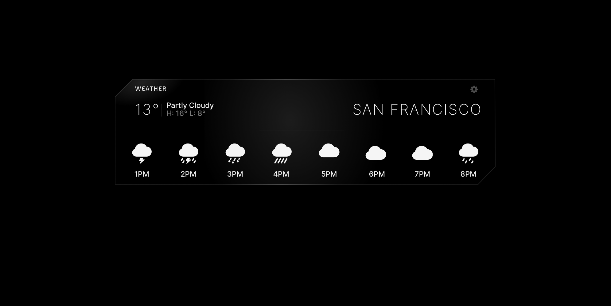

## Antispace Interview

The goal of this excercise is to evaluate your knowledge of React, Next.js and general frontend development.

## Testing the Project

1. Clone this repo
   ```sh
   git clone git@github.com:chingun/antispace-interview-ericallen.git
   ```
2. Change into the project directory
   ```sh
   cd antispace-interview-ericallen
   ```
3. Install dependencies
   ```sh
   npm install
   ```
4. Copy `.env.example` to `.env.local` and fill in the `MAPBOX_API_KEY` with your [MapBox API key](https://console.mapbox.com/account/access-tokens/)
   ```sh
   cp .env.example .env.local
   ```
5. Run the project
   ```sh
   npm run dev
   ```

## Goals

The task is to create a widget that displays a weather forecast for a given location. The design of the widget is below:



### Requirements

- The layout should be implemented exactly as designed.
- Hover glow effect should be implemented
- Hover effect should affect the borders as illustrated
- The settings button should be implemented and allow setting the location and temperature units. The design is up to you, but it should follow the visual style of Antispace.
- The widget should automatically update the data in real or near-real time
- Widget should allow moving left and right to see prior (if the API allows) and future items beyond of what's visible in the bounds. This should be keyboard-able as well.

## Instructions

We use Typescript and encourage you to use it for this project if you know it. But it's by no means required – feel free to use JS.

Whatever API you choose for the weather forecast, it should not be called from the client directly. Wrap it in an API route.

As an optional bonus challenge, how will your solution handle a large number of weather items? Even though no weather API would allow this, how would your solution handle 1,000 items? 10,000 items?

## Considerations

### Product Sense

One important part of the role you're interviewing for is good product sense. To us, this boils down to two things:

1. While you don't have to be a designer yourself, we're looking for engineers who have an eye for design and the finer details – you should know good design when you see it, and be bothered by work that's missing those finishing touches.

2. You are able to build user experienes that delight users with the minimal UI interactions required for users to accomplish tasks, provide helpful and easy to understand UI feedback to users for success, pending, and failure states, etc.

### Code Quality

Another important part of this role is being able to write efficient, reusable, clean code. Fast pages that don't melt the user's CPUs are a crucial part of UX.

### Notes

- Your widget should match our existing design aesthetic, but feel free to add your own spin on it.
- Your solution will be evaluated on UX as well as React code.